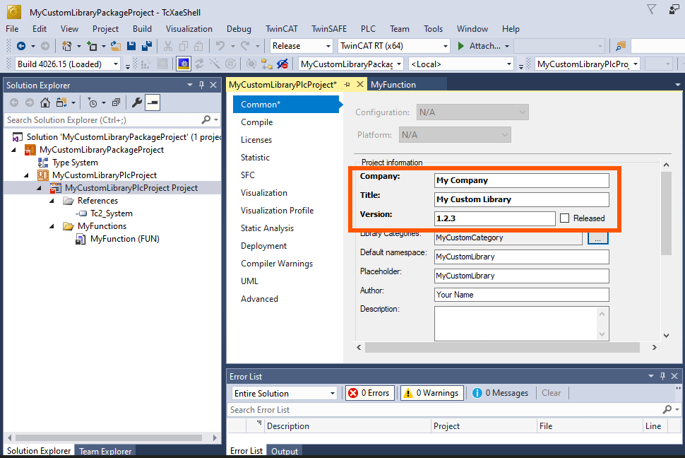

# TcPkg Example - Create a library package

## Disclaimer

This is a personal guide not a peer reviewed journal or a sponsored publication. We make
no representations as to accuracy, completeness, correctness, suitability, or validity of any
information and will not be liable for any errors, omissions, or delays in this information or any
losses injuries, or damages arising from its display or use. All information is provided on an as
is basis. It is the reader’s responsibility to verify their own facts.

The views and opinions expressed in this guide are those of the authors and do not
necessarily reflect the official policy or position of any other agency, organization, employer or
company. Assumptions made in the analysis are not reflective of the position of any entity
other than the author(s) and, since we are critically thinking human beings, these views are
always subject to change, revision, and rethinking at any time. Please do not hold us to them
in perpetuity.

## Description

This repository demonstrates how to create and use a custom TwinCAT library package using `tcpkg`. It includes an example `.nuspec` file, PowerShell scripts, and steps to build, install, and uninstall the package.

## Creating your NuGet Package

The completed nuget example can be found in `./src`. The steps below show you what steps were taken, these should be modified to suit your own needs. You will also find the TwinCAT library file included in the `./twincat-library-src`, which has been included for completeness. Only the files inside of src are used for the nuget package.

### 1. Setup your `.nuspec` File

You can copy, rename and edit the file provided.

```
MyCustomLibraryPackage.nuspec
```

Edit the contents in your code editor (e.g., **VS Code**):

All of the sections in the file are commented, so read through and customize as needed.

```xml
<?xml version="1.0" encoding="utf-8"?>
<!--
  This is a sample .nuspec file for a Chocolatey/NuGet package.
-->
<package xmlns="http://schemas.microsoft.com/packaging/2015/06/nuspec.xsd">
  <metadata>
    <!-- Package ID: must be unique across your feed or nuget.org -->
    <id>MyCustomLibraryPackage</id>

    <!-- Semantic versioning: major.minor.patch -->
    <version>1.2.3</version>

    <!-- Human-friendly name -->
    <title>My Custom Library Package</title>

    <!-- Author name or team -->
    <authors>Your Name</authors>

    <!-- Link to your project site or documentation -->
    <projectUrl>https://www.yourwebsite.com/</projectUrl>

    <!-- Copyright notice -->
    <copyright>(c) Your Name</copyright>

    <!-- License file (or external license link) -->
    <licenseUrl>https://www.yourwebsite.com/license</licenseUrl>

    <!-- Should the user accept the license during install? -->
    <requireLicenseAcceptance>true</requireLicenseAcceptance>

    <!-- Icon shown in Chocolatey GUI, use a PNG file -->
    <icon>icon.png</icon>

    <!-- Tags control how your package is displayed in the UI-->
    <tags> CategoryMy&#160;Custom&#160; AllowMultipleVersions <!--
    Tags:
    - Category<Name>
        Used to organize your packages into logical categories in Chocolatey GUI or your custom feed.
        Example: "CategoryMy&#160;Custom" will be shown as "My Custom".
        Notes:
          • "Category" is stripped from the display name.
          • Use &#160; for non-breaking spaces if the category has multiple words.

    - AllowMultipleVersions
        Allows different versions of the same package to be installed side-by-side.

    - VariantXAE
        Marks this package as intended for Engineering (XAE) environments only.
        Excludes the package from Runtime (XAR) listings.
        Use this to filter visibility and relevance.

    - VariantXAR
        Marks this package as intended for Runtime (XAR) environments only.
        Excludes the package from Engineering (XAE) listings.

    - Workload
        Identifies this package as a "workload" — typically a meta-package that groups or installs
        other packages via dependencies.

      -->
    </tags>

    <!-- One-liner or paragraph description (required) -->
    <description>This is a custom package for delivering a library.</description>

    <!-- Optional: Shown in package viewers -->
    <releaseNotes>These are my custom package release notes. Use markdown</releaseNotes>

    <!-- Optional: Add dependencies to other packages if needed -->
    <dependencies>
      <!-- Example:
      <dependency id="OtherPackage" version="[1.0.0,2.0.0)" />
      -->
    </dependencies>
  </metadata>

  <!-- Files section tells Chocolatey/NuGet which files to include in the package -->
  <files>
    <!-- Icon file for Chocolatey/NuGet UI (although not shown if not a workload) -->
    <file src="PackageIcon.png" target="icon.png" />

    <!-- All scripts and supporting files go in the tools folder -->
    <file src="tools\**" target="tools" />

    <!-- Your actual PLC library file to install -->
    <file src="MyCustomLibraryPlcProject.library" target="tools\MyCustomLibraryPlcProject.library" />
  </files>
</package>
```

### 2. Update PowerShell Scripts

#### `./src/tools/chocolateyInstall.ps1`

Change the name of the library to point to the library file name included in the src folder.

```powershell
# Define custom values
$libraryFileName = "MyCustomLibraryPlcProject.library"
```

#### `./src/tools/chocolateyUninstall.ps1`

Update the following variables:

```powershell
$libraryName = 'My Custom Library'
$version = '1.2.3'
$vendor = 'My Company'
```

This is based on the values used in your library properties.



### 3. Update the LICENCE.txt and VERIFICATION.txt

LICENSE.txt: Replace with your project's actual license terms (or reuse an existing license if appropriate). Be sure to include 3rd party licenses if your library contains 3rd party licensed content.

VERIFICATION.txt: Update the library file name.

### 4. Pack the Library

In this example we are using the folder `C:\LocalFeed` to hold the final NuGet packages. Use the command below to make your package.

```cmd
tcpkg pack "C:\Path\To\MyCustomLibraryPackage.nuspec" -o "C:\LocalFeed"
```

## Installing the Package using CLI

### 1. Add Your Custom Feed (Only once)

```cmd
tcpkg source add -n "My Local Feed" -s "C:\LocalFeed"
```

### 2. Disable Signature Verification (Only once)

```cmd
tcpkg config unset -n VerifySignatures
```

### 3. Install the Package

```cmd
tcpkg install MyCustomLibraryPackage
```

You can now access the library from TwinCAT XAE.

---

## Updating Your Package Version

To release a new version of your custom library package:

### 1. Replace the .library file

Overwrite the existing MyCustomLibraryPlcProject.library file with your updated version.

### 2. Update the version in the .nuspec file

Edit the <version> field in MyCustomLibraryPackage.nuspec to reflect the new version number (e.g. 1.2.4).

### 3. Update the uninstall script

In tools\chocolateyuninstall.ps1, update the $LibraryVersion to match the new version string.

### 4. Repack the package

Run the tcpkg pack command from the directory containing your .nuspec file:

```cmd
tcpkg pack "C:\Path\To\MyCustomLibraryPackage.nuspec" -o "C:\LocalFeed"
```

💡 Tip: Always increment the version number to ensure clients receive the updated package.

## 📁 Folder Structure

```
├── MyCustomLibraryPackage.nuspec          # The package definition file (.nuspec)
├── MyCustomLibraryPlcProject.library      # The PLC library to be installed
├── PackageIcon.png                        # Icon shown in TcPkgUI package listings
├── LICENSE.txt                            # License text (required for publishing to public feeds)
├── VERIFICATION.txt                       # Description of how the package content was verified
└── tools\                                 # Contains Chocolatey install/uninstall scripts
    ├── chocolateyinstall.ps1              # Installs the PLC library using RepTool
    ├── chocolateyuninstall.ps1            # Uninstalls the PLC library using RepTool
    └── chocolateybeforemodify.ps1         # Clears managed library cache before install/upgrade
```
